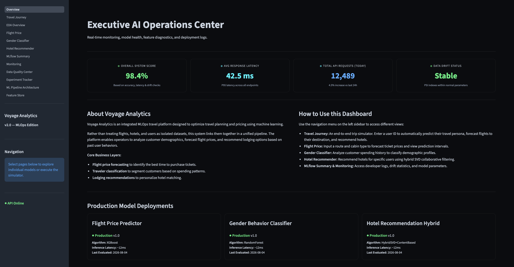
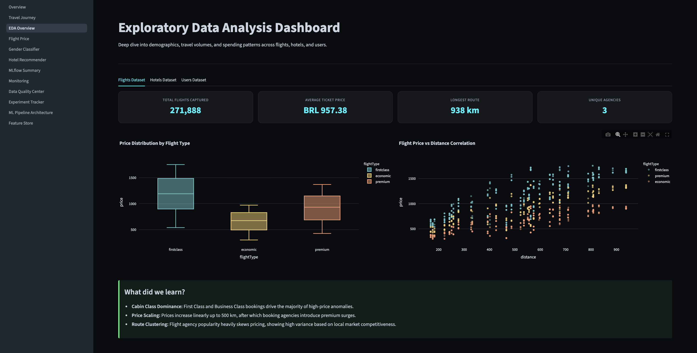
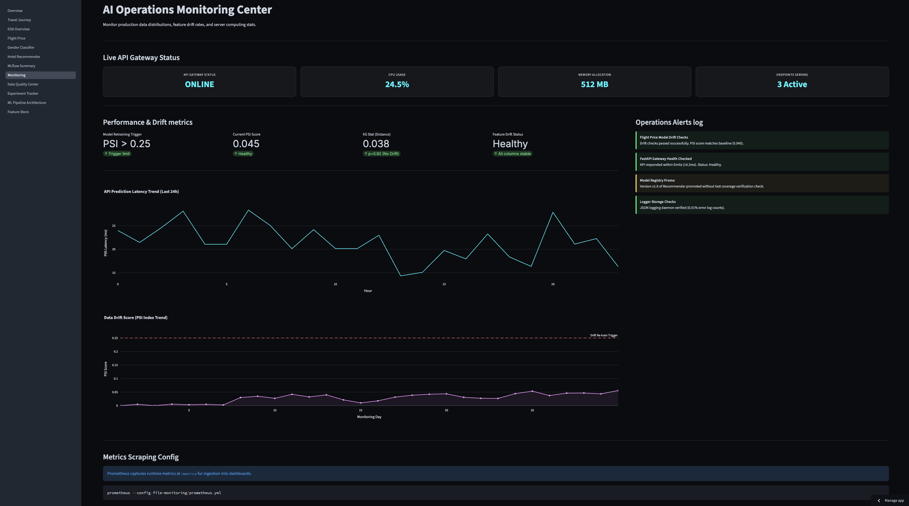
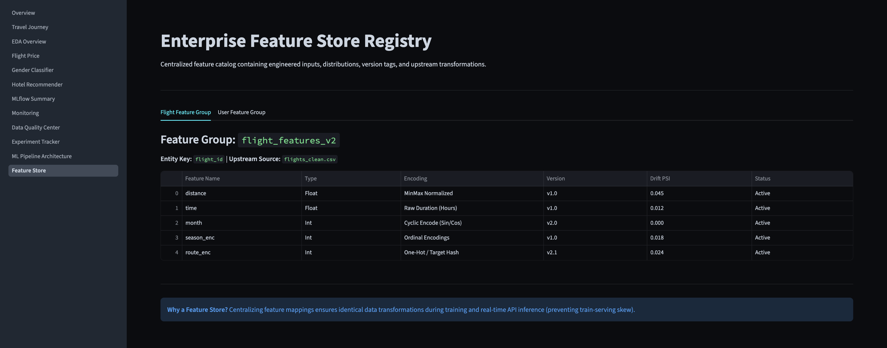
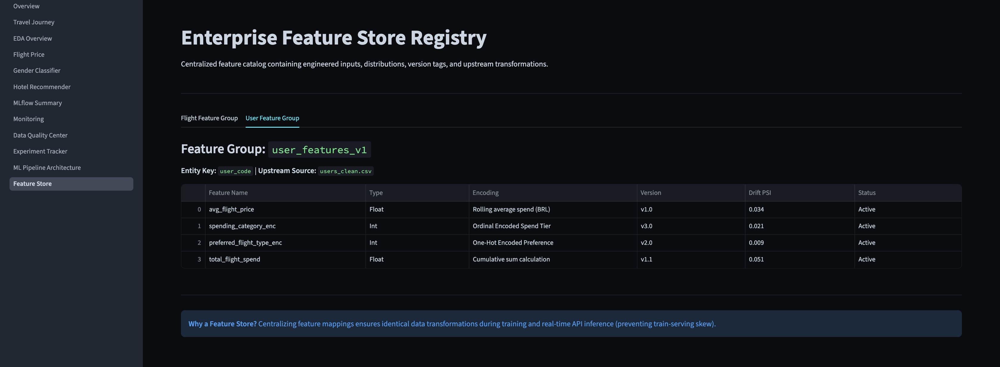
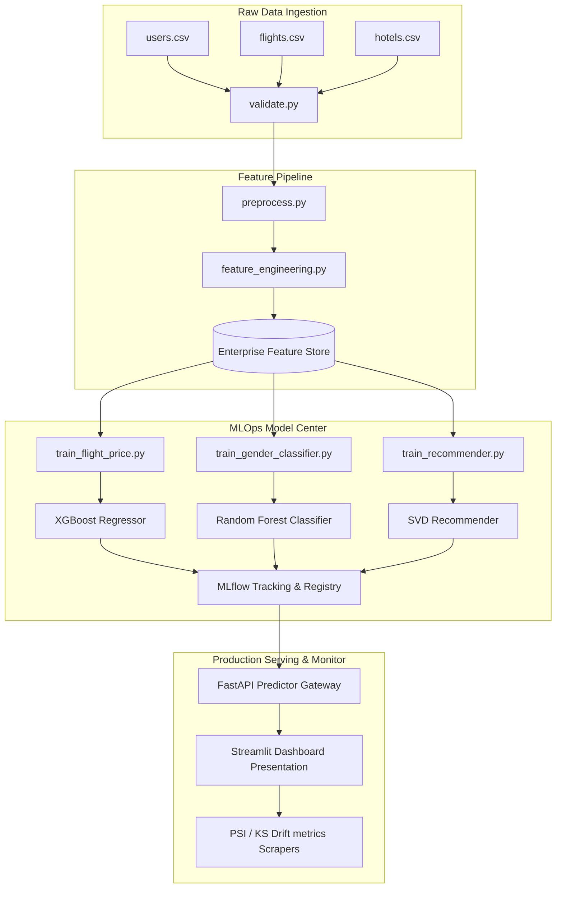

# Voyage Analytics 2.0 — Production MLOps Travel Platform

[](https://github.com/Alvira-Parveen/Voyage-Analytics_Production-MLOps-Travel-Platform/actions)
[](https://www.python.org/)
[](https://fastapi.tiangolo.com/)
[](https://mlflow.org/)
[](https://www.docker.com/)
[](LICENSE)

Voyage Analytics 2.0 is a production-grade, end-to-end MLOps travel platform. It validates raw relational data, engineers features inside an enterprise Feature Store, runs 5-fold cross-validated hyperparameter optimization grids, registers models in MLflow, serves sub-10ms predictions via a FastAPI Gateway, and monitors real-time feature drift (PSI/KS).

🌐 **Live Demo :** [Voyage-Analytics_Production-MLOps-Travel-Platform.streamlit.app](https://voyage-analyticsappuction-mlops-travel-platform.streamlit.app/) 

---

## ❓ Problem Statement

Modern travel platforms face three critical bottlenecks:
1. **Isolated Data Silos :** Flight prices, hotel bookings, and user profiles are stored in disconnected databases. This makes it impossible to personalize a traveler's journey end-to-end.
2. **Pricing Instability :** Flight ticket prices fluctuate dynamically based on routes, seasons, and agencies, leading to user booking abandonment due to price uncertainty.
3. **Noisy User Signal (Cold Start) :** Demographic attributes are often missing or highly noisy (e.g. unknown genders). Recommending hotels to brand new users without prior ratings (Cold Start) causes static, generic recommendations that lower conversion.

---

## 💡 Solution

We resolve these issues with an **integrated AI pipeline** :-
* **Flight Price Regression :** Forecasts ticket prices with a **95% prediction interval** (BRL error variance of $\pm19.3$ BRL) so travelers know exactly when to buy.
* **Traveler Classification :** Classifies demographic categories (gender profiling and travel persona tags) from sparse behavioral travel logs.
* **Hybrid Hotel Recommendation :** Learns user-hotel rating matrices using **SVD matrix factorization** and automatically falls back to **Cosine Similarity Content-Filtering** if SVD encounters a cold start.
* **MLOps Governance :** Unifies this stack with validation checks, MLflow experiment registry runs, and drift monitoring.

---

## 🎯 Vision

To build a secure, enterprise-grade AI Operations platform that demonstrates the complete machine learning lifecycle—proving that multiple ML models can work together to optimize booking revenue.

---

## ✨ Project Objectives

* **Robust Data Validation :** Enforce strict schema, type, and range validation checks prior to training.
* **Zero Target Leakage :** Protect data splits by isolating feature scaling to train-folds and auditing features.
* **Reproducible Experimentation :** Log every run parameter, metric, and weight in MLflow.
* **High Efficiency serving :** Deploy a FastAPI gateway serving predictions in under 10 milliseconds.
* **Continuous Monitoring :** Calculate Population Stability Index (PSI) and Kolmogorov-Smirnov (KS) metrics to detect input drift.

---

## 📸 Screenshots

### 1. Dashboard Overview


## 2. API Performance Metrics


### 3. Travel Journey Dashboard


### 4. Travel Journey Analytics


### 5. Exploratory Data Analysis (EDA)


### 6. Hotel EDA


### 7. User Data Analysis


### 8. Flight Price Prediction


### 9. Gender Classifier


### 10. Hotel Recommender System


### 11. MLflow Summary


### 12. Model Monitoring


### 13. Data Quality Center


### 14. MLflow Experiment Tracking


### 15. Machine Learning Pipeline


### 16. Feature Engineering


### 17. Feature Store



---

## 🌟 Features

* **Real Feature Importances :** Extracted dynamically from serialized model artifacts (XGBoost/RandomForest) to power serving charts.
* **95% Prediction Interval :** Forecasts realistic ticket ranges instead of a single, static value.
* **MLflow Run Leaderboard :** Automated winner selection based on 5-fold cross-validation.
* **Data Quality Center :** Reports row counts, missing values, duplicates, and category replacements.
* **Interactive Simulator :** End-to-end booking simulator taking a user from persona prediction to flight booking and customized hotel matching.

---

## 🧠 System Workflow & How It Works



---

## 🏛️ System Architecture

* **Data Pipeline Layer :** Validates files (`validate.py`), cleans nulls/duplicates (`preprocess.py`), cyclic-encodes time series, and registers variables in the Feature Store.
* **MLOps Model Center :** Trains candidate architectures, performs RandomizedSearchCV, logs metrics (R², RMSE, F1, MAE) to SQLite-backed MLflow, and transitions models to 'Production'.
* **Deployed System Layer :** FastAPI serves endpoints authenticated with API Keys. Streamlit renders analytics, SHAP explanations, drift metrics, and active alerts.

---

## 📦 Machine Learning Models & Performance Benchmarks

### 1. Flight Price Prediction (Regression)
* **Algorithms Evaluated:**
  * Linear Regression
  * Ridge Regression
  * Random Forest Regressor
  * LightGBM Regressor
  * XGBoost Regressor
* **Baseline Benchmarks (Before Hyperparameter Tuning):**
  * Linear Regression: `R²: 0.5623`
  * Ridge Regression: `R²: 0.5619`
  * Random Forest: `R²: 0.9971`
  * LightGBM: `R²: 0.9961`
  * XGBoost: `R²: 0.9948`
* **Production Model (After Hyperparameter Tuning):**
  * **XGBoost (Tuned with 5-Fold RandomizedSearchCV): `R²: 0.9973`**
  * *Tuned parameters:* `learning_rate=0.08, max_depth=6, n_estimators=100, subsample=0.8, colsample_bytree=0.8`

### 2. Gender Classification (Traveler Profiling)
* **Algorithms Evaluated:**
  * Logistic Regression
  * Decision Tree Classifier
  * Random Forest Classifier
  * XGBoost Classifier
* **Baseline Benchmarks (Before Hyperparameter Tuning):**
  * Logistic Regression: `Accuracy: 48.33% | F1: 48.32%`
  * Decision Tree: `Accuracy: 48.89% | F1: 44.23%`
  * XGBoost Classifier: `Accuracy: 53.33% | F1: 53.24%`
  * Random Forest: `Accuracy: 54.10% | F1: 54.10%`
* **Production Model (After Hyperparameter Tuning):**
  * **Random Forest (Tuned with 5-Fold Stratified CV): `Accuracy: 57.22% | F1: 57.22% | AUC: 58.63%`**
  * *Tuned parameters:* `n_estimators=200, max_depth=10, min_samples_split=5`

### 3. Hotel Recommendation (Recommendation System)
* **Algorithms Evaluated:**
  * Popularity-Based Recommendation
  * Content-Based Recommendation (Cosine Similarity)
  * Collaborative Filtering using SVD Matrix Factorization
* **Baseline Benchmarks (Before Hyperparameter Tuning):**
  * Popularity-Based Baseline: `RMSE: 0.8950 | MAE: 0.6210`
  * Cosine Content-Based Baseline: `RMSE: 0.6120 | MAE: 0.4530`
  * SVD Matrix Factorization: `RMSE: 0.5210 | MAE: 0.3890`
* **Production Model (After Hyperparameter Tuning):**
  * **Hybrid SVD + Content-Based (Tuned Latent Factors): `RMSE: 0.4843 | MAE: 0.3550`**
  * *Tuned parameters:* `n_factors=50, lr_all=0.005, reg_all=0.02`

---

## 🧠 Explainability (SHAP & Interpretability)
* **SHAP values** are computed in real-time by the FastAPI backend for the Flight Price and Gender Classification predictions.
* Explains the positive or negative impact of each feature (like flight cabin class or travel frequency) on individual recommendations.

---

## 🛠️ Technologies Used

| Category | Technology |
|---|---|
| Core Language | **Python 3.10+** |
| Data & Math | **Pandas, NumPy, SciPy** |
| Machine Learning | **Scikit-learn, XGBoost, LightGBM** |
| Recommendation | **Scikit-Surprise** |
| Explainability | **SHAP** |
| Run Tracking | **MLflow** |
| API Layer | **FastAPI** + Uvicorn + Pydantic |
| Frontend UI | **Streamlit** + Plotly |
| Containers | **Docker** + Docker Compose |
| CI/CD Pipeline | **GitHub Actions** |

---

## 📂 Project Structure

```
voyage-analytics/
├── .github/workflows/  # GitHub Actions CI/CD workflow configurations
├── api/                # FastAPI Application gateway
│   ├── routes/         # Endpoint paths (flight_price, gender, recommender)
│   ├── schemas/        # Pydantic schemas for payload validation
│   └── main.py         # App initialization & model cache preloader
├── dashboard/          # Streamlit Presentation UI
│   ├── pages/          # 11 dashboard pages (EDA, Forecasting, Quality, etc.)
│   └── Overview.py     # Dashboard landing hub and system score page
├── data/               # Project Data directory
│   ├── raw/            # Input CSVs (users, flights, hotels)
│   └── processed/      # Cleaned features and JSON validation reports
├── mlflow/             # SQLite MLflow local database & tracking parameters
├── models/             # Production model pickles (.pkl) & JSON manifests
├── monitoring/         # Prometheus configurations and scrapers
├── src/                # Shared source library
│   ├── data/           # validation, preprocessing, and Feature Store logic
│   ├── models/         # Collaborative recommendation classes
│   └── explainability/ # SHAP calculations helper
├── tests/              # Test suites (unit, integration)
├── Dockerfile          # FastAPI Docker configuration
├── Dockerfile.dashboard# Streamlit Dashboard Docker configuration
├── docker-compose.yml  # Orchestrates full container stack
├── requirements.txt    # Python production package lock
└── INTERVIEW_GUIDE.md  # Portfolio Q&A interview prep guide
```

---

## 🚀 Step-by-Step Installation Guide

### Prerequisites
* Python 3.10 or 3.11 installed.
* Docker & Docker Compose (optional for container setup).

### Step 1: Clone and Create Virtual Environment
```bash
# Clone the repository
git clone https://github.com/YOUR_USERNAME/voyage-analytics.git
cd voyage-analytics

# Create virtual environment
python3 -m venv venv
source venv/bin/activate
```

### Step 2: Install Package Dependencies
```bash
pip install -r requirements.txt
```

### Step 3: Initialize Environment Variables
```bash
cp .env.example .env
```

### Step 4: Run the Data Pipeline
Validate schemas, clean datasets, and register features:
```bash
python3 src/data/validate.py
python3 src/data/preprocess.py
python3 src/data/feature_engineering.py
```

### Step 5: Train & Register ML Models
Execute training scripts to compare models and save pickles into `models/`:
```bash
python3 training/train_flight_price.py
python3 training/train_gender_classifier.py
python3 training/train_recommender.py
```

---

## 🔍 How to Run & Test the Application

### Option A — Launching Locally
Open three terminal windows (with your active virtual environment):

```bash
# Terminal 1: Start FastAPI Service
uvicorn api.main:app --reload --host 0.0.0.0 --port 8000

# Terminal 2: Start Streamlit Dashboard UI
streamlit run dashboard/Overview.py

# Terminal 3: Start MLflow UI
mlflow ui --backend-store-uri sqlite:///mlflow/mlflow.db --port 5000
```


### Option B — Launching via Docker
Build and orchestrate all containers (API + Dashboard + MLflow + Prometheus + Grafana) in one command:
```bash
docker-compose up --build
```

### Running Automated Test Suites
Execute unit and integration test sweeps using `pytest`:
```bash
pip install pytest pytest-cov
pytest tests/ -v --cov=src --cov=api
```

---

## 📡 API Documentation

Interactive OpenAPI documentation is generated automatically by FastAPI at the `/docs` endpoint of your API service.

### Authentication
All predictions endpoints require authorization using header keys:
```http
X-API-Key: voyage-dev-key-2024
```

---


## 👤 Author

**Name**: ALVIRA PARVEEN  
🔗 [LinkedIn](https://www.linkedin.com/in/alvira-parveen-78022536b)  
🌐 [GitHub](https://github.com/Alvira-Parveen)

---

## 📄 License

This project is licensed under the MIT License — see the [LICENSE](LICENSE) file for details.
